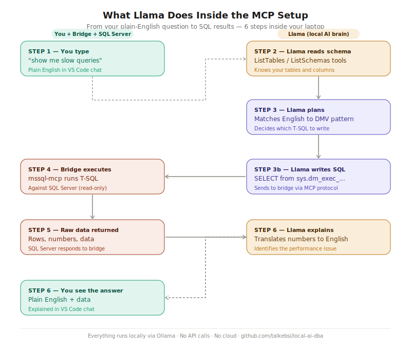

# 🤖 Local AI DBA Assistant — SQL Server + MCP + Ollama

> **100% Secure & Private. Zero Cloud. Zero Tokens. Everything runs on your machine.**

A fully local AI-powered DBA assistant that lets you query SQL Server using plain English — no cloud AI, no internet required, no data ever leaves your machine.

---

## 📋 Table of Contents

- [What This Setup Does](#what-this-setup-does)
- [Why This Project Matters](#why-this-project-matters)
- [Security](#security)
- [Architecture Overview](#architecture-overview)
- [How Llama Works Inside the Setup](#how-llama-works-inside-the-setup)

- [Prerequisites](#prerequisites)
- [Step 1 — Install .NET 9 SDK](#step-1--install-net-9-sdk)
- [Step 2 — Clone and Build the MCP Bridge](#step-2--clone-and-build-the-mcp-bridge)
- [Step 3 — Install Ollama and Pull the Model](#step-3--install-ollama-and-pull-the-model)
- [Step 4 — Create a Read-Only SQL Server Login](#step-4--create-a-read-only-sql-server-login)
- [Step 5 — Set the Connection String](#step-5--set-the-connection-string)
- [Step 6 — Install VS Code and Continue.dev](#step-6--install-vs-code-and-continuedev)
- [Step 7 — Configure Continue.dev](#step-7--configure-continuedev)
- [Step 8 — Test the Bridge Manually](#step-8--test-the-bridge-manually)
- [Step 9 — Test in VS Code](#step-9--test-in-vs-code)
- [Example DBA Questions to Ask](#example-dba-questions-to-ask)
- [Security Notes](#security-notes)

---

## What This Setup Does

Instead of writing T-SQL manually, you type plain English questions in VS Code:

```
Show me the top 10 queries consuming the most CPU right now
```

```
Are there any missing indexes in my database?
```

```
Show me the size of each database on my instance?
```

The local AI reads your question, writes the correct T-SQL, executes it against your SQL Server through a secure read-only connection, and returns the results explained in plain English — all without touching the internet.
## Security

- All processing is local (no cloud APIs)
- Uses a read-only SQL login
- MCP enforces controlled query execution
- No data leaves the machine
---
## Why This Project Matters

This project demonstrates how AI can assist DBAs in:

- Translating natural language into accurate SQL queries  
- Query optimization and tuning complex T-SQL statements  
- Performance troubleshooting using DMVs and real-time diagnostics  
- Learning SQL Server internals through interactive exploration  
- Automating repetitive DBA tasks and investigations  
- Reducing time to diagnose issues like blocking, waits, and resource bottlenecks  
- Providing a safe, read-only environment for experimentation and learning  
- Enabling self-service data exploration without deep SQL knowledge  

It bridges the gap between traditional DBA skills and modern AI-assisted workflows — all in a fully private, local environment.

## Architecture Overview



## How Llama Works Inside the Setup



### How Each Component Fits Together

| Component | Role | Why It's Needed |
|---|---|---|
| **VS Code + Continue.dev** | Your interface for typing questions | Provides the chat UI and Agent mode |
| **Ollama** | Runs the local AI model | Replaces cloud AI like ChatGPT |
| **Llama 3.2 3B** | The AI brain | Understands English, writes T-SQL |
| **mssql-mcp bridge** | The translator | Connects AI to SQL Server via MCP protocol |
| **SQL Server** | Your database | Where your data lives |

---


## Prerequisites

Before starting, make sure you have:

- Windows 10/11 machine (this guide is Windows-focused)
- SQL Server Developer Edition installed (any version 2017+)
- A database to test with (AdventureWorks recommended — download from Microsoft)
- Git installed — https://git-scm.com/download/win
- VS Code installed — https://code.visualstudio.com
- .NET 9 SDK installed — https://dotnet.microsoft.com/en-us/download/dotnet/9.0

---

## Step 1 — Install .NET 9 SDK

The mssql-mcp bridge is built with .NET 9. You need the SDK (not just the runtime).

1. Go to: https://dotnet.microsoft.com/en-us/download/dotnet/9.0
2. Under **SDK**, download the **Windows x64 Installer**
3. Run the installer and follow the prompts
4. Verify installation — open Command Prompt and run:

```bash
dotnet --version
```

You should see `9.0.xxx` ✅

---

## Step 2 — Clone and Build the MCP Bridge

The [mssql-mcp project](https://github.com/Aaronontheweb/mssql-mcp) by Aaronontheweb is the bridge between the AI and SQL Server.

Open Command Prompt and run:

```bash
cd C:\Users\YourName
git clone https://github.com/Aaronontheweb/mssql-mcp.git
cd mssql-mcp
dotnet build --configuration Release
```

> Replace `YourName` with your actual Windows username

When it finishes you should see `Build succeeded`. Verify the DLL was created:

```bash
dir "C:\Users\YourName\mssql-mcp\src\MSSQL.MCP\bin\Release\net9.0\MSSQL.MCP.dll"
```

If the file appears with a size — the bridge is built ✅

> **Note:** If you see only a `Debug` folder and no `Release` folder, re-run the build with `--configuration Release` explicitly.

---

## Step 3 — Install Ollama and Pull the Model

Ollama runs AI models locally on your machine.

1. Go to: https://ollama.com
2. Download for Windows and install normally
3. Verify Ollama is running by opening your browser and going to:

```
http://localhost:11434
```

You should see: `Ollama is running` ✅

Now pull the recommended model:

```bash
ollama pull llama3.2:3b
```

This downloads about 2GB. When done, verify:

```bash
ollama list
```

You should see `llama3.2:3b` in the list ✅

**You may use any model you prefer, as long as your device can handle it.**

### Why Llama 3.2 3B?

I chose Llama 3.2 3B because it runs efficiently on my laptop without consuming excessive resources.
It provides reliable tool-calling support for MCP/Agent workflows while maintaining fast response times.
This makes it ideal for a lightweight, fully local SQL Server DBA assistant.

### Model Recommendations by Machine

| Model | Tool Calling | RAM Usage | Response Speed |
|---|---|---|---|
| `llama3.2:3b` ✅ **Recommended** | Excellent | ~2GB | Fast (~30-60 sec on CPU) |
| `llama3.1:8b` | Excellent | ~5GB | Moderate (~2-3 min on CPU) |

---

## Step 4 — Create a Read-Only SQL Server Login

This is your safety net. The AI can only SELECT data — it cannot delete, update, or drop anything.

Open SSMS, connect to your SQL Server instance, and run:

```sql
-- Create the server-level login
CREATE LOGIN mcp_readonly
WITH PASSWORD        = 'YourStrongPassword123!',
     CHECK_EXPIRATION = OFF,
     CHECK_POLICY     = OFF;

-- Switch to your database
USE YourDatabaseName;

-- Create a database user linked to the login
CREATE USER mcp_readonly FOR LOGIN mcp_readonly;

-- Grant read-only access to all tables
EXEC sp_addrolemember 'db_datareader', 'mcp_readonly';

-- Allow reading performance DMVs (essential for DBA tuning queries)
GRANT VIEW SERVER STATE   TO mcp_readonly;
GRANT VIEW DATABASE STATE TO mcp_readonly;
```

**Test the login works:**

In SSMS: File → New → Database Engine Query → connect with `mcp_readonly` and your password.

```sql
-- This should work ✅
SELECT TOP 5 name FROM sys.tables;

-- This should be denied ✅
DROP TABLE HumanResources.Employee;
```

---

## Step 5 — Set the Connection String

The bridge reads the connection string from a Windows environment variable. This is more reliable than passing it through the config file on Windows.

Open **Command Prompt as Administrator** and run:

```bash
setx MSSQL_CONNECTION_STRING "Server=YOUR_SERVER_NAME;Database=YourDatabaseName;User ID=mcp_readonly;Password=YourStrongPassword123!;Encrypt=true;TrustServerCertificate=true;"
```

**Important notes:**
- If your SQL Server is a **named instance** (e.g. `MYPC\SQLDEV1`), use that full name — `localhost` will not work
- If it is the **default instance**, use `localhost`
- After running `setx`, **close the Command Prompt window** and open a new one — `setx` only takes effect in new windows

Verify it was saved:

```bash
echo %MSSQL_CONNECTION_STRING%
```

It should print your full connection string ✅


---

## Step 6 — Install VS Code and Continue.dev

1. Open VS Code
2. Click the **Extensions icon** in the left sidebar (4 squares)
3. Search for `Continue`
4. Install the extension by **Continue.dev**
5. After install, a **C icon** appears in your left sidebar

---

## Step 7 — Configure Continue.dev

Press `Ctrl + Shift + P` → type `Continue: Open config` → press Enter.

A file called `config.yaml` opens. Replace its entire contents with:

```yaml
name: Local Config
version: 1.0.0

# Master policy — allows MCP tools to run without the "Apply" button
policy:
  - action: use_tool
    resource: mssql-local/*
    effect: allow

models:
  - name: Llama 3.2 3B
    provider: ollama
    model: llama3.2:3b
    # Critical for smaller models to enable Agent Mode tool calling
    capabilities:
      - tool_use
    system_prompt: >
      You are an expert SQL Server DBA assistant.
      Your environment is SQL Server (Developer Edition) on instance YOUR_SERVER_NAME.
      Your primary database is YourDatabaseName.

      When I ask a question:
      1. Use T-SQL syntax only.
      2. If I ask about performance, use DMVs (e.g., sys.dm_os_wait_stats or sys.dm_exec_query_stats).
      3. Use the available MCP tools (mssql-local) to explore the schema before writing complex joins.
      4. Always assume the user 'mcp_readonly' has read-only access.
    # Optimized for machines with small or integrated GPU memory
    requestOptions:
      numPredict: 512
      contextLength: 4096
      temperature: 0.1
    roles:
      - chat
      - edit
      - apply
      - autocomplete
      - embed

mcpServers:
  - name: mssql-local
    command: dotnet
    args:
      - "C:\\Users\\YourName\\mssql-mcp\\src\\MSSQL.MCP\\bin\\Release\\net9.0\\MSSQL.MCP.dll"
    env:
      MSSQL_CONNECTION_STRING: "Server=YOUR_SERVER_NAME;Database=YourDatabaseName;User ID=mcp_readonly;Password=YourStrongPassword123!;Encrypt=true;TrustServerCertificate=true;"

experimental:
  readOnly: false
  remoteConfigServerUrl: null
  # Tells Continue.dev the model supports tool calling despite the warning
  model_allows_tools: true

# Automatic execution — no manual approval needed for these tools
tools:
  - name: mssql-local/ExecuteSql
    always_approve: true
  - name: mssql-local/ListTables
    always_approve: true
  - name: mssql-local/ListSchemas
    always_approve: true
```

**Replace these placeholders before saving:**
- `YOUR_SERVER_NAME` → your SQL Server instance name (e.g. `MYPC\SQLDEV1` or `localhost`)
- `YourDatabaseName` → your actual database name
- `YourName` → your Windows username
- `YourStrongPassword123!` → the password you set in Step 4

> **YAML path note:** In YAML files, backslashes must be doubled. `MYPC\SQLDEV1` becomes `MYPC\\SQLDEV1` inside the YAML.

Press `Ctrl + S` to save ✅

---

## Step 8 — Test the Bridge Manually

Before testing in VS Code, always confirm the bridge works on its own first.

Open a **new** Command Prompt (important — must be a new window to pick up the environment variable) and run:

```bash
cd C:\Users\YourName\mssql-mcp\src\MSSQL.MCP\bin\Release\net9.0
dotnet MSSQL.MCP.dll
```

You should see:

```
info: ... Server (stream) (MSSQL.MCP) transport reading messages.
info: ... Application started.
info: ... Database connection validated successfully! Ready to process MCP requests.
```

If you see `Database connection validated successfully` — the bridge is connected to SQL Server ✅

Press `Ctrl + C` to stop it. The bridge will be started automatically by VS Code when needed.

### Common Errors at This Stage

| Error | Cause | Fix |
|---|---|---|
| `MSSQL_CONNECTION_STRING environment variable must be provided` | setx not run or old terminal window | Open new Command Prompt after setx |
| `Unable to connect to the database` | Wrong server name or SQL Server not running | Verify instance name with `SELECT @@SERVERNAME` |
| `Login failed for user 'mcp_readonly'` | Login not created or wrong password | Re-run Step 4 in SSMS |
| `Named Pipes / TCP connection error` | TCP not enabled | Enable TCP in SQL Server Configuration Manager |

---

## Step 9 — Test in VS Code

**Startup order matters — always follow this sequence:**

```
1. Confirm SQL Server is running   (connect in SSMS)
2. Confirm Ollama is running       (check http://localhost:11434)
3. Open VS Code
4. Click the C icon (Continue.dev) in the left sidebar
5. Switch mode to Agent (bottom left of chat panel)
6. Select Llama 3.2 3B as the model
```

**Check the Tools panel:**

Click the wrench icon in Continue.dev. You should see:

```
MCP Servers
  mssql-local  🟢
    Tools (3)
      ListSchemas    Automatic
      ListTables     Automatic
      ExecuteSql     Automatic
```

Green dot = bridge connected ✅

**Run your first test:**

```
List all tables in my database
```

The AI should call `ListTables` directly and return your real table names — no Apply button, no JSON, no terminal commands.

---

## Example DBA Questions to Ask

Once your setup is working, try these:

### Orientation
```
List all tables in my database
List all schemas
How many rows are in the Sales.SalesOrderHeader table?
```

### Performance Tuning
```
Show me the top 10 queries consuming the most CPU right now
Are there any missing indexes in my database?
Which indexes have never been used since the last restart?
Show me current wait statistics
Are there any blocking sessions right now?
```

### Storage and Maintenance
```
Show me the size of each database on my instance
Which databases have never been backed up?
Show me the last backup date for each database
Which tables have the most fragmented indexes?
```

### Security
```
List all logins with sysadmin privileges
Show me all users in my database and their roles
```

---

## Security Notes

- The `mcp_readonly` login can only SELECT — it cannot INSERT, UPDATE, DELETE, DROP, or ALTER anything
- `VIEW SERVER STATE` permission is granted to allow DMV queries for performance tuning — this is read-only access to server state information
- Never use `sa` or a sysadmin account for the MCP connection
- Review AI-generated SQL before trusting it in any environment beyond your practice machine
- The AI operates entirely locally — no queries, schema information, or results are sent to any external service

---

## References

- [mssql-mcp by Aaronontheweb](https://github.com/Aaronontheweb/mssql-mcp)
- [Continue.dev documentation](https://docs.continue.dev)
- [Ollama model library](https://ollama.com/library)
- [SQL Server DMV reference](https://docs.microsoft.com/en-us/sql/relational-databases/system-dynamic-management-views)
- [Original blog post inspiration — SQL Authority by Pinal Dave](https://blog.sqlauthority.com/2025/10/27/sql-server-and-ai-setting-up-an-mcp-server-for-natural-language-tuning/)

---

*Built by a SQL Server DBA, for SQL Server DBAs. All processing is local. Your data stays yours.*
